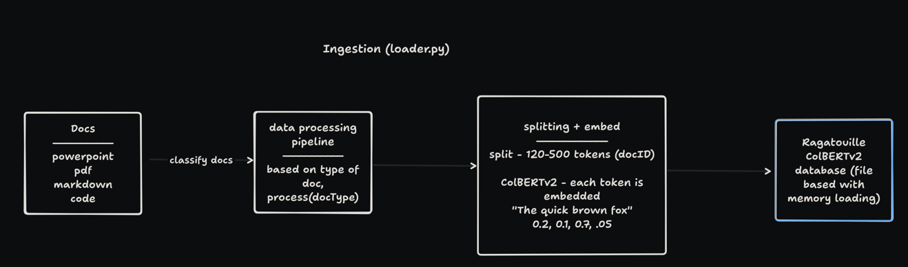
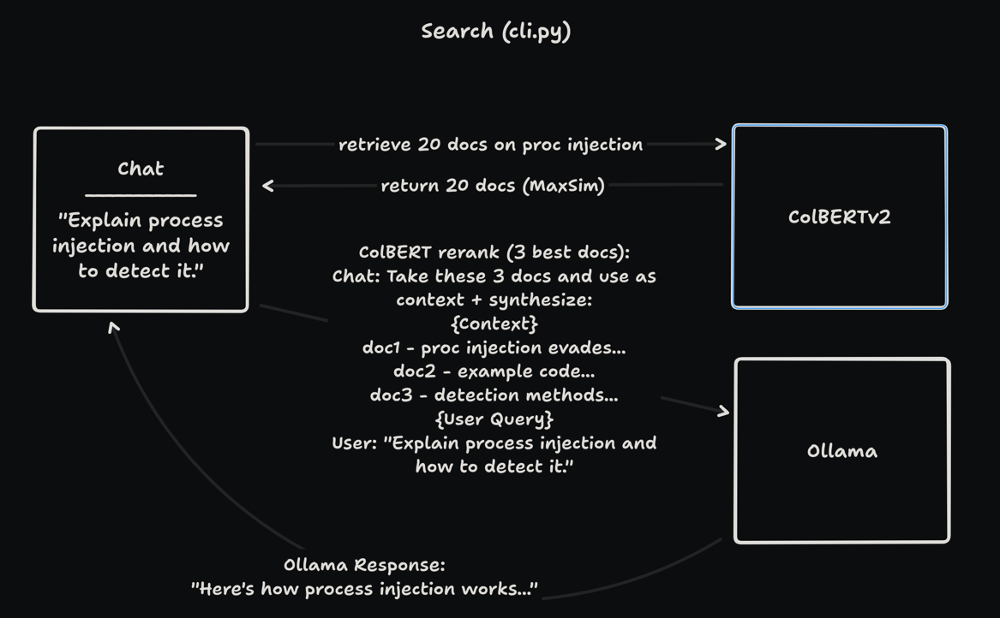

# Architecture
Docs are ingested, processed based on the file extension and embedded in a vector database proprietary to ColBERTv2.
  
  

During the user search, the cli tool will retrieve x amount of documents, then it uses a reranker to provide the best docs
to Ollama. A query is rendered for Ollama that contains the docs, the user query, and a prompt instructing Ollama to 
synthesize its own data with the provided data when responding.

  

More details in the [writeup](writeup.md)
